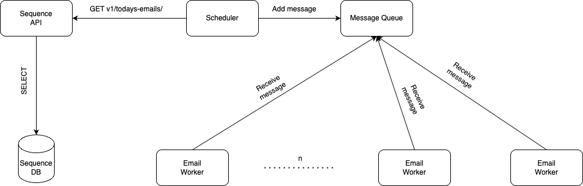

# Sequence API

## Testing

```bash
go test ./...
```

Tests require docker deamon do be available - they use testcontainers lib to instantiate test postgres instance.

## Running

To run the API just execute the following command:

```bash
docker compose up
```

Then it's time for some demo requests - this can be done using [hurl]():

```bash
hurl demo.hurl
```

## Email sending system design

Here's a drawing providing a high level view on a simple but scalable email sending system design.



The idea is to use a scheduler component which can be ran periodically (e.g. as k8s batch job). It's main job will be to continously poll for the emails that are about to be sent. Then for each email it would submit a message to a queue (e.g. SQS) with the email details and the mailbox that should be used. Then such message will be picked up by one of our workers which will process it. To make sure that every single email is sent, workers will not delete the message from the queue immediately after receiving it but instead they will set some invisibility timeout so that if they fail to finish their work the message will go back to the queue and it will be picked up by some other worker. Invisibility timeout can be constant for fast operations but in case if email sending process can take some more time it would be a good idea to add a heart beat functionality that will prolong the message invisibility as long as the worker is processing it.